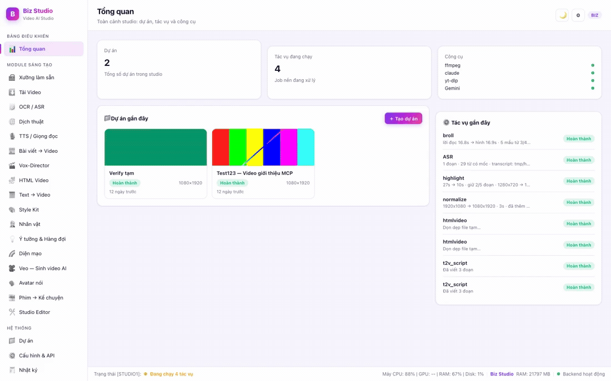
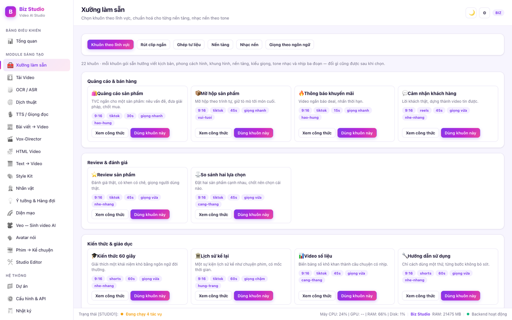
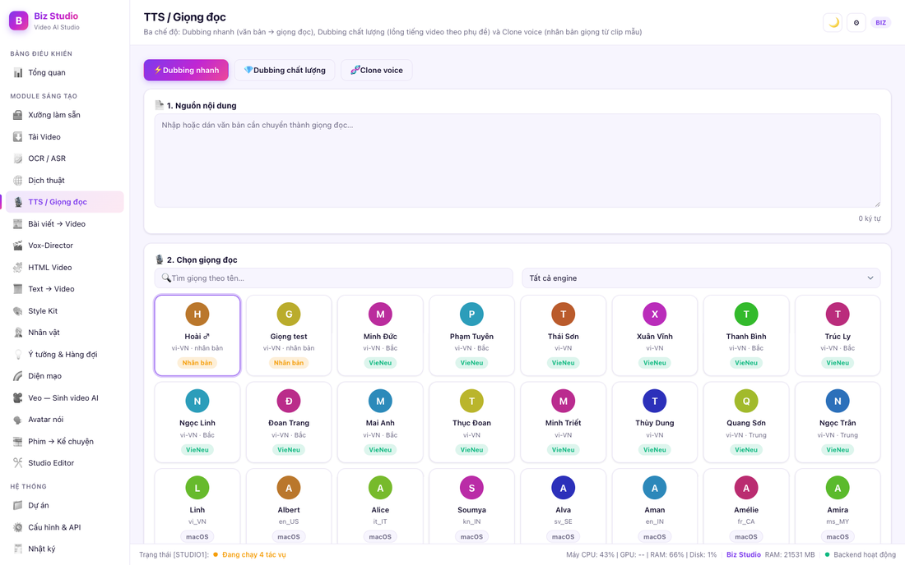
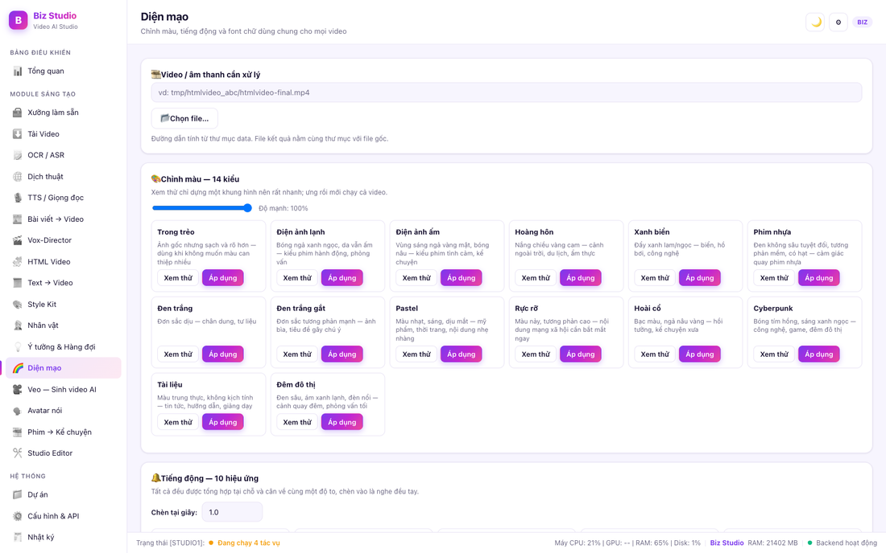

# 🚀 Biz Studio

[Tiếng Việt](README.md) · [**English**](README.en.md)

**Studio video AI chạy hoàn toàn trên máy của bạn** — biến ý tưởng, bài viết và footage thô thành video hoàn chỉnh: AI tự edit, tự cắt, tự tạo phụ đề, tự lồng tiếng, tự QC và tự đóng gói xuất bản.

Điểm khác biệt lớn nhất: phần AI edit video chạy qua **Claude CLI** (`claude -p`) — tức là dùng **subscription Claude (khuyên dùng gói Max 5x trở lên)**, *không tốn phí API theo token*. Một phiên edit phức tạp có thể tiêu 15M–60M token, nhưng tất cả nằm trong hạn mức subscription của bạn.



🎬 **Xem video giới thiệu:** [Biz-Studio-intro-final.mp4](Biz-Studio-intro-final.mp4) — *chính video này được tạo bằng module HTML Video + giọng đọc VieNeu của Biz Studio.*

---

## Mục lục

- [Có gì mới](#có-gì-mới)
- [Biz Studio làm được gì](#biz-studio-làm-được-gì)
- [Hệ thống vận hành thế nào](#hệ-thống-vận-hành-thế-nào)
- [Phiên AI edit video hoạt động ra sao](#phiên-ai-edit-video-hoạt-động-ra-sao)
- [Cài đặt & chạy](#cài-đặt--chạy)
- [Đóng gói exe / dmg / linux](#đóng-gói-exe--dmg--linux)
- [Cấu hình](#cấu-hình)
- [Các module chi tiết](#các-module-chi-tiết)
- [REST API](#rest-api)
- [Cấu trúc dữ liệu & mã nguồn](#cấu-trúc-dữ-liệu--mã-nguồn)
- [Khắc phục sự cố](#khắc-phục-sự-cố)
- [Cảm hứng & ghi nhận](#cảm-hứng--ghi-nhận)

---

## Có gì mới

### v2.12.0 — 22/08/2026 — Timeline nhiều lớp: âm thanh + phụ đề

Anh Hoài chỉ cho một [trình dựng](https://github.com/Lexombien/lemyloi-dichvideos) fork từ [OpenCut](https://github.com/OpenCut-app/OpenCut) (85,4k sao, MIT) và hỏi editor của mình thiếu gì. Câu trả lời thật: timeline cũ chỉ là **hai hàng V1/A1 hiển thị asset dạng khối màu** — bấm vào chỉ để chọn, không kéo được, không cắt được, không có playhead. Nó là bảng kiểm kê, không phải trình dựng.

Nay có timeline dựng được thật, cho **âm thanh và phụ đề**:

- 🎚️ **Nhiều lớp âm thanh** — lời đọc, nhạc nền, tiếng động, mỗi lớp bao nhiêu đoạn tuỳ ý. **Kéo để dời, kéo mép để cắt, S để tách tại playhead, Delete để xoá.** Có sóng âm vẽ trên từng khối nên thấy ngay chỗ nào có tiếng nói.
- 🔊 **Nghe thử ĐÚNG bằng bản xuất ra, không độ trễ** — trình duyệt tự trộn bằng WebAudio thay vì chờ máy chủ render. Kéo một cái là nghe được ngay.
- 🎯 **Né lời đọc theo lớp** — bật cho lớp nhạc là nhạc tự lùi mỗi khi có lời đọc. Đo trên bản dựng thật: bật né thì đoạn đang nói nhỏ đi 2,4 dB so với khi tắt.
- 💬 **Lớp phụ đề** — thêm/sửa/xoá dòng ngay trên timeline, hiện đè lên video lúc xem trước, ghi thẳng lên hình lúc dựng.
- 🏷 **Đoán vai trò từ tên file** — `nhac-nen.mp3` vào thẳng lớp nhạc, `sfx-whoosh.wav` vào lớp tiếng động. Sai thì một cú bấm là sửa.
- ⚡ **Không có phụ đề thì COPY stream hình**, không mã hoá lại — nhanh hơn nhiều lần và không mất chất lượng.

**Chỉ một lớp video, và đó là chủ ý.** Âm thanh với phụ đề thì trình duyệt trộn và hiện được nên xem trước đúng 100%. Lồng video trên video bắt buộc phải ghép hình — hoặc đổi cả giao diện sang React như OpenCut, hoặc render nháp ở máy chủ rồi kéo một cái chờ một hai giây. Cả hai đều là chuyện khác; giao diện web giữ nguyên nên lúc nào làm cũng không phải viết lại.

Kiểm bằng ffmpeg thật chứ không so chuỗi: 14 test dựng file, chạy filtergraph, rồi **đo âm lượng từng khoảng** để chứng minh đoạn nằm đúng giây, nhạc thật sự lùi, và file không câm.

### v2.11.0 — 21/08/2026 — Chấm điểm theo lô, prompt theo thể loại, hợp tuyển theo chủ đề

Đọc [AutoClip](https://github.com/zhouxiaoka/autoclip) (6,7k sao, MIT) và soi lại mã của mình, lòi ra một lỗi đang nằm trong bản người ta đã tải về.

- 🔴 **Sửa lỗi rút clip hỏng trên video dài** — chính là ca dùng của nó. Đo thật: video 2 tiếng ra **1.107 đoạn ứng viên**, mà mã cũ gửi hết trong MỘT lượt và bắt AI trả về 1.107 dòng JSON. Model hoặc bị cắt giữa chừng (mất trắng lượt chạy), hoặc chấm vài trăm dòng rồi tự đóng mảng đúng cú pháp — kiểu thứ hai hỏng **lặng lẽ**: gửi 300 đoạn, nhận 100, clip dựng ra **chỉ dùng 2% đầu video** mà không có lấy một dòng cảnh báo.
  Nay chấm theo lô 60 đoạn, **đếm lại số đoạn nhận được**, thiếu đoạn nào thì hỏi lại đúng những đoạn đó. Thiếu ít thì chạy tiếp nhưng nói ra; thiếu quá 20% thì báo lỗi thay vì dựng một clip không đáng tin. 6 test canh gác.
- 🎯 **Prompt theo thể loại nội dung** — 7 thể loại (kiến thức, quan điểm, giải trí, trải nghiệm, kinh doanh, phỏng vấn, tự cân bằng), mỗi loại một gu chấm riêng. Prompt cũ chỉ có một và nghiêng hẳn về kiến thức/quan điểm — *"câu gây tò mò, con số bất ngờ, tuyên bố mạnh"* — đem chấm một vlog đời thường là rớt hết vì "không có thông tin".
- 🗂 **Hợp tuyển theo chủ đề** — tab mới. Rút clip lấy các đoạn đắt nhất bất kể nói về cái gì rồi ghép làm MỘT video; hợp tuyển đọc xem chúng nói về cái gì rồi tách ra NHIỀU video, mỗi video một chủ đề. Một buổi phỏng vấn hai tiếng ra "chuyện khởi nghiệp", "sai lầm tuyển người", "chuyện gia đình". Mỗi đoạn chỉ thuộc một hợp tuyển; trong mỗi hợp tuyển các đoạn vẫn xếp theo đúng thứ tự thời gian gốc.
- 🐞 Kèm một lỗi nữa test bắt được lúc đang viết: bảng bỏ dấu tiếng Việt (dùng đặt tên file hợp tuyển) viết tay hai chuỗi song song và **lệch 2 ký tự** — "đ" ra "y". Nay dựng bảng bằng mã nên lệch là chuyện không thể xảy ra.

Không lấy từ AutoClip: Celery + Redis + FastAPI + React. Biz Studio là một binary — thêm Redis là mất luôn tính "tải về chạy ngay".

### v2.10.0 — 21/08/2026 — App độc lập, không cần mở trình duyệt

Trước đây bấm vào Biz Studio là trình duyệt bật lên một tab lẫn giữa mười tab khác, có thanh địa chỉ, có nút back — nhìn không ra một phần mềm. Nay nó mở **cửa sổ app riêng**.

- 🪟 **Cửa sổ app thật**: không thanh địa chỉ, không tab, không nút back, có mục riêng trên Dock/taskbar. Chạy trên nền Chrome/Edge/Brave đã có sẵn ở chế độ `--app`, hồ sơ riêng nên không đụng vào phiên đăng nhập và tab đang mở của bạn.
- 🚪 **Đóng cửa sổ là thoát** — nhả cổng luôn, không để lại tiến trình ma. **Trừ khi còn việc đang render**: khi đó máy chủ vẫn sống và nói rõ còn mấy việc, xong hết mới tự thoát. Đóng nhầm cửa sổ không mất một tiếng render.
- 🔁 **Bấm mở lần hai không còn lỗi**: trước đây bản thứ hai chết vì "address already in use" — với người dùng là "bấm vào app mà chẳng thấy gì". Nay nó mở thêm cửa sổ vào bản đang chạy rồi thoát.
- 🪟 **Windows có hai file**: `Biz Studio.exe` bấm đúp ra cửa sổ app, **không kèm cửa sổ console đen**; `bizstudio.exe` giữ console cho dòng lệnh. Không gộp được vì cờ `-H windowsgui` cắt luôn stdout, gộp là lệnh `setup` câm.
- 🐧 **Linux có `.desktop`** để hiện trong menu ứng dụng, `StartupWMClass` khớp `--class` nên thanh tác vụ hiện Biz Studio chứ không phải icon Chrome.
- 🖥 **Máy chủ không màn hình**: `-window=false`. Trên Linux tự tắt khi không có `DISPLAY`/`WAYLAND_DISPLAY` — gọi trình duyệt trên máy không màn hình chỉ tổ treo vài giây rồi chết kèm một đống lỗi Xlib chẳng liên quan.

Vẫn **một binary, cross-compile đủ 5 nền tảng từ một máy**. Không dùng webview của hệ điều hành vì nó bắt buộc CGO — mà bật CGO là mất khả năng đó, phải dựng CI riêng cho từng hệ điều hành.

### v2.9.0 — 21/08/2026 — Cài công cụ một chạm

Một người dùng gặp `HTTP Error 403: Forbidden` khi tải video và tưởng mình bị chặn. Đo thật: yt-dlp trên máy là bản **2026.07.04**, mới nhất là **2026.08.19** — cũ 6 tuần. Cập nhật xong là hết lỗi ngay. Thông báo lỗi của yt-dlp không hề nhắc tới phiên bản, nên không có cách nào đoán ra.

- 🧰 **Thẻ "Công cụ trên máy" trong Cấu hình & API** — FFmpeg, yt-dlp, Chrome, VieNeu-TTS, faster-whisper. Mỗi dòng hiện phiên bản thật, có nút **Cài** (chưa có) hoặc **Cập nhật** (đã có). Nhật ký cài chạy trực tiếp trong trang.
- ⏰ **Cảnh báo yt-dlp cũ**: bản quá 30 ngày tuổi sẽ được nói thẳng "bản này đã N ngày tuổi — lỗi 403 khi tải thường là do bản cũ". Đọc ngày từ chính số phiên bản, không cần gọi mạng.
- 🪟 **Chạy được trên Windows**: thêm `setup-vieneu.ps1` và `setup-whisper.ps1`. Script **nhúng thẳng vào binary** — bản dmg/zip không kèm thư mục `scripts/`, nếu đọc từ đĩa thì nút sẽ chết ở đúng những máy cần nó nhất.
- 🧩 **Dùng trình quản lý gói của máy**: brew (macOS), winget (Windows), apt/dnf/pacman (Linux). Không tải script lạ từ mạng về chạy. Thiếu brew/winget thì hiện đúng link tải chính thức.
- 🖥 **`bizstudio setup <công-cụ>`** ở dòng lệnh — máy chủ không màn hình vẫn cài được, và agent gặp lỗi `kind: "dependency"` có đúng một câu lệnh để tự gỡ. Nhận cả `yt-dlp` lẫn `ytdlp`.
- 🐞 **Sửa lỗi lệch kiến trúc trên Apple Silicon** (có từ trước, nay mới lộ): nếu Biz Studio là bản x86_64 chạy qua Rosetta, `pip` cài wheel x86_64 — nhưng lúc chạy mã Go luôn ép python qua `arch -arm64`, sinh ra `ImportError: incompatible architecture` ở tận bước nạp thư viện. Script cài giờ ép arm64 bằng `sysctl hw.optional.arm64` (dùng `uname -m` là sai — dưới Rosetta nó nói dối). Đo lại: wheel từ `macosx_11_0_x86_64` thành `macosx_14_0_arm64`, cùng binary x86_64 đó cài xong chạy được.

### v2.8.0 — 16/08/2026 — Giao diện tiếng Anh trọn vẹn

- 🌐 **Nút VI / EN ở thanh trên** — **toàn bộ 1.541 chuỗi giao diện** đã dịch, cộng các chuỗi phía server hiện lên UI (tên và công thức 22 khuôn, 6 preset nền tảng, 7 tone nhạc, 6 Style Kit, 10 tiếng động). Tổng **1.683 mục**.
- 🔌 **Chặn ở đúng một chỗ**: mọi chữ lên màn hình đều đi qua `appendChild()` trong `ui.js`. Không phải sửa 24 file trang, và trang mới thêm sau này tự được dịch. Chuỗi phía Go dùng **chính từ điển JS** — chúng về UI dưới dạng dữ liệu rồi cũng đi qua cửa đó, nên không phải dựng lớp i18n riêng cho Go hay đụng vào 1.599 chỗ trong mã.
- 🔍 **Độ phủ kiểm bằng cách gắn bộ thu vào app đang chạy** rồi đi qua đủ 21 trang, ghi lại mọi chuỗi lọt qua mà không được dịch — không phải đếm dòng mã. Cách này bắt được loại sót mà quét mã nguồn không thấy: chuỗi ghép từ nhiều dòng literal, lúc trích thì tách rời còn lúc chạy lại nối làm một.
- 🙅 **Tên giọng, tên dự án và nội dung của bạn giữ nguyên** — đó là tên riêng và dữ liệu, dịch là sai.

Thêm ngôn ngữ mới = chép một file, dịch vế phải, thêm một thẻ `<script>`. Chuỗi chưa dịch rơi về tiếng Việt chứ không vỡ giao diện.

### v2.7.0 — 16/08/2026 — Dòng lệnh cho script và AI agent

Từ trước tới nay Biz Studio chỉ dùng được qua giao diện web. Nay có **dòng lệnh**, chạy được từ terminal, từ script, hoặc để một AI agent tự điều phối.

```bash
# ghép clip tư liệu khớp lời đọc
bizstudio broll --clips ./tu-lieu --audio voice.wav --workdir ./viec --aspect 16:9

# chuẩn hoá cho TikTok — chỉ cần --workdir, không phải chép lại đường dẫn
bizstudio normalize --workdir ./viec --platform tiktok
```

Sáu lệnh: `probe`, `normalize`, `broll`, `autocut`, `platforms`, `templates`.

Bốn quy ước, mỗi cái sinh ra từ một cách hỏng cụ thể khi **máy đọc kết quả của máy**:

- **Dòng cuối trên stdout luôn là MỘT dòng JSON**, log tiến độ đi hết sang stderr. Bắt agent đọc log dạng chữ là bắt nó đoán, mà log thì đổi luôn.
- **Mỗi lệnh ghi `bizstudio_manifest.json`** vào thư mục làm việc. Lệnh sau chỉ cần trỏ đúng thư mục là dùng lại được kết quả lệnh trước.
- **`--dry-run`** kiểm tham số và dựng manifest mà không chạy gì tốn kém — thử được câu lệnh trước khi đốt một tiếng render.
- **Lỗi có phân loại** và mã thoát riêng: `usage` (mã 2) → sửa tham số · `dependency` (mã 3) → cài `ffmpeg`/`ffprobe` · `retryable` (mã 4) → thử lại · `failed` (mã 1). "Thất bại" chung chung thì agent chỉ biết thử lại mù.

Cờ đặt **trước hay sau** tên file đều được — `normalize phim.mp4 --platform tiktok` và `normalize --platform tiktok phim.mp4` cho cùng kết quả. Gói `flag` của Go vốn dừng ở đối số đầu không phải cờ, nên cách viết tự nhiên nhất lại là cách hỏng.

Chạy web vẫn y như cũ: không có tên lệnh thì `bizstudio -port 6868 -data data` vào thẳng giao diện.

### v2.6.0 — 14/08/2026 — Ghép clip tư liệu

- 🎞 **Ghép clip tư liệu khớp lời đọc**: kiểu video "đọc trên nền tư liệu" hay gặp ở kênh tin tức, kiến thức, review. Đưa vào một thư mục clip và một file lời đọc — hệ thống cắt clip thành mẩu ngắn, **xoay vòng qua TỪNG clip** để mọi file đều lên hình, ghép cho đủ dài rồi cắt đúng bằng lời đọc.

  Lời đọc là thứ dẫn, hình chạy theo tiếng chứ không ngược lại — tiếng đã thu rồi, co kéo tiếng là hỏng lời đọc. Clip lệch tỉ lệ thì **thêm viền chứ không bóp méo** (đo thật: 16:9, 1:1 và 9:16 trộn chung một video, mỗi loại nhận viền đúng cạnh). Tư liệu ngắn hơn lời đọc thì dùng lại và **báo rõ đã lặp mấy vòng**. File gốc không bị đụng tới.

  Xoay vòng qua từng clip là chỗ dễ làm sai nhất: lấy tuần tự hết clip này mới sang clip kia thì đo thật với 4 clip cho một video 17 giây, **chỉ 2 clip đầu lên hình** — người dùng đưa 4 file mà chỉ thấy 2.

- ⚡ **Xuất nhanh hơn 1,7 lần**: bước chuẩn hoá nền tảng đang dùng `-preset medium` trong khi 9 chỗ khác đều dùng `veryfast`. Đo trên bản render thật: `medium` tốn gấp **1,7 lần** thời gian và cho ra file **to hơn**, đổi lại chênh lệch hình ở mức **PSNR 56,5 dB / SSIM 0,9986** — trên 50 dB là mắt không phân biệt được.

  Đã thử cả **tăng tốc bằng phần cứng** (`h264_videotoolbox`): trên máy đo được nó **chậm hơn 13%** so với `libx264 -preset veryfast` đang dùng, nên không đổi.

### v2.5.0 — 12/08/2026 — Rút clip ngắn từ video dài

- ✂️ **Video dài → clip ngắn**: hệ thống bóc băng, để AI **chấm điểm từng đoạn** theo mức đáng giữ, rồi ghép các đoạn đắt nhất. Đo thật trên một video 27 giây có 6 câu (2 câu cố ý ê a vô nghĩa) — clip 10 giây trả về giữ đúng con số gây sốc và câu giải thích, bỏ sạch lời chào chung chung cùng hai câu *"À thì, ừm, để tôi xem lại đã nhé"* và *"Ừ, cái này, ờ, cũng bình thường thôi"*.

  Ba luật khiến kết quả nghe được chứ không phải một mớ vụn ghép lại:
  - **Chọn theo điểm, xếp theo thời gian.** Ghép theo thứ tự điểm thì câu chuyện nhảy cóc tới lui, người xem không lần ra mạch.
  - **Mép cắt nới ra tới TỪ trọn vẹn** rồi mới đệm 120ms đầu / 180ms đuôi. Mốc câu của bản bóc băng không khớp chính xác mốc từ, cắt đúng mốc câu vẫn xén mất nửa âm.
  - **Không có khoá AI thì báo lỗi rõ, không chấm bừa.** Cắt nhầm đoạn còn tệ hơn không cắt, vì người dùng tưởng máy đã chọn hộ.

  Chọn nền tảng thì thời lượng tự ép xuống dưới trần của nền tảng đó, và video được chuẩn hoá luôn. **Video gốc không bị đụng tới.**

- 🐛 **Sửa lỗi phụ đề teo khi chuẩn hoá nền tảng**: burn phụ đề lúc render rồi mới chuẩn hoá là đường đi rất tự nhiên, nhưng bước chuẩn hoá **thu nhỏ cả khung** nên phụ đề teo theo mà không có gì báo. Đo thật: video 16:9 có phụ đề chiếm 3,98% chiều cao khung, chuẩn hoá sang khung dọc TikTok còn **1,25% — nhỏ đi 3,2 lần**, gần như không đọc nổi trên điện thoại. Nay báo cáo chuẩn hoá tính sẵn hệ số và cảnh báo thẳng, kèm cách làm đúng. Công thức khớp số đo trong sai số 0,6%.

  Chiều ngược lại thì **không** bị: video dọc đặt vào khung ngang lấp trọn chiều cao nên chữ giữ nguyên tỉ lệ — nên phải tính theo chiều cao khung chứ không theo hệ số thu ảnh.

### v2.4.0 — 11/08/2026 — Truyện tranh vẽ tay

- ✏️ **Hiệu ứng "đang được vẽ ra"**: ảnh của cảnh hiện ra theo ba lớp quét ngang — **nét đen trắng** trước, rồi **tô bóng xám**, rồi **lên màu**. Vùng chưa vẽ là nền trang trắng chứ không phải bóng mờ của bức tranh (hé trước nội dung thì mắt đọc ra là ảnh đang rõ dần, không phải nét đang được vẽ). Dùng được cho cả ảnh AI sinh lẫn **ảnh bạn tự vẽ đưa vào**. Lớp màu xong ở 78% thời lượng cảnh, chừa phần còn lại để nhìn bức tranh đã hoàn chỉnh.
- 📖 **Chuyển cảnh lật trang**: trang bị một đường **cong** quét từ phải sang, kèm dải mép gấp có gradient giả chỗ giấy cuộn. Cong chứ không thẳng — thẳng thì đọc ra là cái gạt nước. Mép trên chạy trước mép dưới một nhịp vì tay lật giấy bao giờ cũng nhấc góc trên trước. Vùng đã lật mang **màu nền của chính trang** nên lật xong thấy trang tiếp theo, không phải một hố đen.
- 📐 **Khung hình 3:4** (1080×1440): dọc kiểu **trang giấy**, vừa một trang truyện tranh hay trang nhật ký mà không phải cắt cụt hai đầu.

Cả ba nằm **trọn trong thời lượng của chính cảnh** như fade/dip đã có — đo thật: video 3 cảnh 3+4+3 giây ra đúng **10,02 giây**, hình không lệch khỏi giọng đọc đã thu.

### v2.3.0 — 10/08/2026 — Khuôn cảnh HTML Video nâng cấp

- 🐛 **Sửa một lỗ hổng lặng lẽ trong việc đóng gói font**: bốn ký hiệu trong khuôn cảnh — dấu tích `✓`, ngôi sao `✦`, con trỏ `▍`, nút play `▶` — **không có trong font tiếng Việt đóng gói kèm** (Be Vietnam Pro chỉ có 459 glyph; đọc thẳng bảng cmap của font ra thế). Chúng rơi sang font của hệ điều hành, tức lọt đúng khỏi cái mà việc đóng gói font sinh ra để tránh: **hai máy render ra hai kiểu**. Trên macOS nhìn vẫn ổn nên lỗi này không bao giờ tự lộ. Nay cả bốn **vẽ bằng hình học CSS** — đo lại: đổi sang một họ font không tồn tại, ảnh của dấu tích / ngôi sao / nút play ra **giống hệt từng byte**.
- 👁 **Mỗi khung tối đa 3 phần tử đang sáng**: cảnh 6 gạch đầu dòng trước đây có khung cuối 6 dòng cùng sáng như nhau, mắt không biết nhìn đâu. Nay dòng mới vào thì dòng cũ **lùi lại** (mờ còn 42% và thụt nhẹ) chứ không biến mất — vẫn đọc được, hết giành nhìn.
- ⏸ **Dừng 0,3 giây trước khi con số chạy** ở cảnh biểu đồ: trước đây số chạy ngay lúc nhãn còn đang bay vào, mắt chưa kịp biết đang đọc chỉ số gì đã phải đuổi theo số.
- 🪶 **Ba đường cong thay vì một**: trước đây mọi phần tử dùng chung một đường cong nên chữ tiêu đề nặng và cái huy hiệu nhỏ về đích y như nhau. Nay tiêu đề dùng `expo` (đáp xuống chứ không dừng lại), huy hiệu dùng `back` (vọt quá một chút rồi lùi về).
- ⏱ **Nhịp co theo thời lượng cảnh**: video 15 giây chia 6 cảnh thì mỗi cảnh chỉ 2,5 giây — nhịp cũ cố định khiến gạch đầu dòng cuối và con số cuối **chưa kịp hiện đã hết cảnh**. Nay nhịp tự co, luôn chừa ≥0,7 giây cuối cho khung chốt đứng yên.

### v2.2.0 — 09/08/2026 — Xưởng làm sẵn

- 🧰 **22 khuôn theo lĩnh vực / 7 nhóm** (quảng cáo & bán hàng, review, kiến thức, kể chuyện, mạng xã hội, doanh nghiệp, giải trí): mỗi khuôn gói sẵn hướng viết kịch bản, **nhịp ba đoạn** (mở đầu / thân / chốt), phong cách hình, khung hình, nền tảng, kiểu giọng và tone nhạc. Bấm **Dùng khuôn này** rồi chọn dựng bằng **HTML Video** (hình bằng HTML/CSS — chữ và số liệu sắc nét, không tốn lượt AI sinh ảnh) hay **Text → Video** (hình sinh bằng AI theo bộ Style Kit, có lưu phiên). Cả hai đường đều nhận sẵn khung hình, độ dài và hướng viết; hướng dẫn đi kèm như một trường riêng nên **lời bạn gõ vẫn nguyên văn**, AI không đem câu chữ trong khuôn vào lời đọc.

  Đo thật với khuôn *Quảng cáo sản phẩm* (khuôn dặn: mở bằng nỗi đau, không nói tên sản phẩm ở câu đầu) — cùng một nguồn, cùng một model:

  | | Đoạn mở đầu AI viết ra |
  |---|---|
  | Không khuôn | "**Máy lọc nước Kangaroo KG100** sở hữu chín lõi lọc vượt trội…" |
  | Có khuôn | "Nguồn nước sinh hoạt hằng ngày **liệu có thực sự an toàn**? Vi khuẩn và kim loại nặng vẫn có thể đang tồn tại ngay trong nước bạn dùng." |

  Phiên Text → Video hiện rõ khuôn đang dùng và **gỡ được bất cứ lúc nào** — khuôn nắn kịch bản một cách lặng lẽ, giấu đi thì mở lại phiên cũ không hiểu vì sao kịch bản ra khác.
- 🎯 **6 preset xuất theo nền tảng** (TikTok, Instagram Reels, YouTube Shorts, YouTube ngang, Facebook Reels, vuông 1:1): đưa video về đúng khung hình và **−14 LUFS** chuẩn phát. Lệch tỉ lệ thì **thêm viền chứ không bóp méo hình**; dài quá trần thì **báo chứ không tự cắt** — cắt hộ là quyết định của người dựng, không phải của phần mềm. Kèm số liệu vùng an toàn để chữ quan trọng không bị giao diện nền tảng che.
- 🎵 **7 tone nhạc nền** (hào hứng, vui tươi, nhẹ nhàng, căng thẳng, hùng tráng, u ám, huyền ảo) **tổng hợp tại chỗ bằng ffmpeg**, cân về cùng −24 dB đỉnh, vào/ra mờ dần để nối vòng lặp không nghe thấy chỗ cắt. Không mang theo nhạc của ai — nhạc có bản quyền lọt vào video là bị nền tảng **gỡ tiếng hoặc chặn kiếm tiền**. Cố ý không có giai điệu chính để không giành chỗ với lời đọc; muốn nhạc thật thì vẫn tự đưa file vào như cũ. Hệ thống tự gợi ý tone theo từ khoá trong kịch bản.
- 🗣 **205 giọng gom thành 41 ngôn ngữ có tên tiếng Việt**: làm video tiếng Anh, Nhật, Trung, Hàn, Pháp… không cần cài thêm gì — máy bạn đã có sẵn. Trước đây danh sách chỉ hiện mã kiểu `ja_JP` nên không ai tìm ra giọng tiếng Nhật.

### v2.1.0 — 08/08/2026 — Hồ sơ nhân vật

- 🐛 **Sửa lỗi làm model vẽ sai người**: prompt sinh ảnh trước đây ghép cả **tên nhân vật** vào (`Featuring Elsa: ...`). Model ảnh thiên vị rất nặng với tên riêng — đặt tên nhân vật là Elsa hay Naruto thì nó vẽ đúng nhân vật nó đã học, **đè lên mô tả ngoại hình bạn viết**. Nay prompt chỉ còn mô tả — thứ duy nhất có thẩm quyền.
- 📖 **Hồ sơ nhân vật đầy đủ**: giới tính, tuổi, thân phận, ngoại hình chi tiết, các từ tính cách, khí chất, động cơ, tuyến phát triển, vùng miền — AI dựng từ mô tả ngắn bạn đã có, sửa tay được.
- 📐 **Bản vẽ ba góc nhìn**: chân dung + ba hình chiếu (trước/bên/sau) + dải chi tiết trên một khung 16:9, dùng làm tờ tham chiếu giữ ngoại hình nhất quán cho cả video. Bố cục **khoá cứng tỉ lệ**, ánh sáng chia theo vùng (chân dung có hướng sáng để ra khối; ba hình chiếu ánh sáng phẳng để tách nền và đo tỉ lệ).
- 🎙 **Ghép giọng theo tính cách**: từ giới tính và vùng miền trong hồ sơ, hệ thống chọn sẵn giọng VieNeu hợp nhất. Không đọc được giới tính thì **không ghép** còn hơn gán bừa; ghép được nhưng lệch vùng miền thì **nói rõ** chứ không lặng lẽ thay giọng.
- ⚠️ **Sửa một quả mìn hẹn giờ**: model mặc định ghim cứng `gemini-2.5-flash`. Đo trên khoá Gemini vừa tạo — model đó trả **404 "no longer available to new users"**, tức mọi người mới cài đều gặp lỗi ngay lần chạy đầu. Nay mặc định là bí danh `gemini-flash-latest`, Google tự trỏ sang đời mới nhất.

### v2.0.0 — 07/08/2026 — Phim → Kể chuyện & xuất CapCut

- 🎞️ **Phim → Kể chuyện**: đưa một bộ phim vào, hệ thống **chia cảnh theo chuyển cảnh hình ảnh**, AI **nhìn khung hình thật của từng cảnh** rồi viết lời dẫn theo phong cách (kể chuyện / review / tóm tắt), đọc bằng giọng Việt của máy (kể cả giọng đã nhân bản), dựng lại thành video lời kể đè phim — **tiếng phim tự lùi 14dB khi lời đang nói** (đo thật), hết câu nâng lại. Không có khoá AI vẫn dùng được: hệ thống chia cảnh, bạn tự viết lời.
- 🚫✂️ **Không bao giờ cắt cụt lời**: lời dài hơn cảnh thì giọng tăng tốc tới trần 1.6x, vẫn thiếu thì cảnh tự **đóng băng khung cuối** kéo dài cho tròn câu (đo: lời 16.1 giây trong cảnh 4 giây → cảnh nở thành 10.1 giây, không mất chữ nào). Track tiếng mỗi cảnh dài **đúng bằng** hình nên ghép trăm cảnh không trôi đồng bộ.
- 👁️ **Máy dò cảnh nhìn cả màu lẫn sáng**: bộ so cảnh của ffmpeg chỉ nhìn kênh sáng — hai màu khác hẳn nhưng cùng độ sáng là nó mù (đo thật: đỏ→xanh lá cho điểm 0.000). Biz Studio chạy **hai máy dò trong một lượt giải mã** (kênh sáng + hai kênh màu) nên bắt đủ các cú chuyển đổi-màu-không-đổi-sáng: phim thử 4 cảnh bắt đúng 4/4 mốc tới từng phần trăm giây.
- 📦 **Xuất dự án CapCut (.draft)**: bấm một nút là có thư mục draft đặt thẳng vào kho draft của CapCut — track hình cắt theo cảnh, track lời, track chữ đầy đủ, chỉnh tiếp trong CapCut. Lời tràn cảnh tự nằm track thứ hai, có báo rõ. *Lưu ý: định dạng draft do cộng đồng mổ ngược, không được nhà phát hành cam kết; draft trỏ media theo đường dẫn trên máy xuất.*
- ⚡ **Cache giọng theo nội dung lời**: sửa một cảnh rồi dựng lại không phải chờ máy đọc lại cả phim.

### v1.9.0 — 04/08/2026 — Avatar nói (LongCat-Video)

- 🗣️ **Avatar nói**: một tấm ảnh + một file giọng → video nhân vật nói, khẩu hình khớp lời. Dùng **LongCat-Video-Avatar** của Meituan (giấy phép MIT, miễn phí, không thuê bao tháng như các nền tảng avatar AI khác).
- 🔗 **Nối thẳng vào giọng Việt sẵn có**: gõ chữ → VieNeu đọc bằng giọng Việt (kể cả **giọng bạn đã nhân bản**) → dựng luôn thành video người nói. Không phải đi tìm file giọng ở đâu khác — cả dây chuyền chạy trên máy bạn, không tốn phí API.
- 🖥️ **Máy nào cũng dùng được.** LongCat là model 13,6 tỉ tham số, **bắt buộc GPU NVIDIA** — không có bản cho Apple Silicon hay CPU. Nên có hai chế độ:

| Chế độ | Khi nào dùng |
|---|---|
| `local` | Biz Studio chạy ngay trên máy có GPU NVIDIA |
| `remote` | Máy bạn không có GPU — cài LongCat trên một máy GPU, chạy `scripts/longcat-worker.py` ở đó, máy bạn làm bàn điều khiển |

Cài trên máy GPU: `./scripts/setup-longcat.sh` → điền đường dẫn (local) hoặc bật xưởng render rồi điền địa chỉ máy GPU (remote) vào Cấu hình & API.

### v1.8.0 — 04/08/2026 — Sinh video bằng AI (Google Veo)

- 🎥 **Veo — sinh video AI**: mô tả cảnh bằng lời (tiếng Việt cũng được), Google Veo dựng thành clip 4/6/8 giây **có tiếng**, dọc 9:16 hoặc ngang 16:9, 720p/1080p/4K. Dùng được ảnh làm khung hình đầu. Clip xong tự vào thư viện media của dự án.
- 💵 **Đây là module DUY NHẤT tiêu tiền thật của bạn theo từng lần bấm**, nên toàn bộ thiết kế xoay quanh việc không ai bị trừ tiền ngoài ý muốn: chi phí ước tính hiện sẵn và tính lại mỗi khi đổi tuỳ chọn, bấm tạo thì hiện hộp xác nhận nhắc lại con số, backend từ chối mọi yêu cầu thiếu cờ xác nhận. Không ước tính được giá thì **báo lỗi** chứ không hiện $0.
- 🔑 **Khách tự gắn khoá của mình** — khoá Veo khai riêng trong Cấu hình & API (Veo đòi dự án Google đã bật thanh toán, không có bậc miễn phí); để trống thì dùng chung khoá Gemini.

| Model | 720p | 1080p | Clip 8 giây |
|---|---|---|---|
| Veo 3.1 chuẩn | $0.40/giây | $0.40/giây | **$3.20** |
| Veo 3.1 nhanh | $0.10/giây | $0.12/giây | **$0.80–0.96** |
| Veo 3.1 lite | $0.05/giây | $0.08/giây | **$0.40–0.64** |

> Veo 3 đã được Google đánh dấu **ngừng hỗ trợ** — hệ thống vẫn giữ tuỳ chọn cho ai đang phụ thuộc, nhưng mặc định là Veo 3.1.

### v1.7.0 — 04/08/2026 — Diện mạo & chuyển động

- 🎨 **14 kiểu chỉnh màu** — Trong trẻo, Điện ảnh lạnh/ấm, Hoàng hôn, Xanh biển, Phim nhựa, Đen trắng (2 mức), Pastel, Rực rỡ, Hoài cổ, Cyberpunk, Tài liệu, Đêm đô thị. Không kèm file LUT nên chạy được ngay trên máy trắng. Xem thử chỉ dựng **một khung hình** nên gần như tức thì; ưng rồi mới chạy cả video. Chỉnh được độ mạnh 10–100%.
- 🔔 **10 tiếng động** — Vút qua, Bụp, Ting, Tách, Vút lên, Dộng, Dựng cao trào, Gõ chữ, Lấp lánh, Hụt xuống. Tất cả được **tổng hợp tại chỗ** bằng ffmpeg (không mang theo thư viện âm thanh của ai) và cân về cùng một độ to nên chèn vào là nghe đều tay. Chèn theo mốc giây, nghe thử ngay trên trang.
- 🔤 **Font tiếng Việt Be Vietnam Pro** — font hệ điều hành thiếu chữ có dấu chồng tầng nên trình duyệt mượn font khác ngay giữa từ: *“Ưu điểm vượt trội”* hiện ra **hai kiểu chữ trong cùng một dòng**. Tải font một lần (~400 KB, giấy phép SIL Open Font) là mọi máy render ra cùng một kiểu chữ.
- 📐 **Bố cục Key cho video dọc** — từ khoá chính ở dải trên, từ khoá liên quan ở dải dưới, cả hai đều dừng trước vùng bị ứng dụng xem video che (15% dưới, 12% phải). Hai dải không nằm trong khối ảnh nền nên ảnh phóng mà chữ vẫn đứng yên.
- 🎬 **Chuyển cảnh & chuyển động điện ảnh** — chuyển cảnh nằm **trong** thời lượng của chính cảnh, nên tổng thời lượng video không đổi một phần nghìn giây nào và hình vẫn bám đúng giọng đọc. Ảnh nền trôi đổi hướng theo từng cảnh, lớp chữ trôi ngược tạo chiều sâu.
- 🎭 **Vai cảnh** — mỗi đoạn nhận vai mở đầu / nội dung / kêu gọi hành động; vai quyết định kiểu trình bày thay vì suy theo vị trí.
- ↻ **Thử lại hàng đợi hàng loạt** — lỗi hàng đợi thường hỏng theo cụm (hết lượt gọi AI, mất mạng, ổ đầy), nên có nút thử lại tất cả ý tưởng hỏng và nút xếp hàng mọi ý tưởng đã duyệt.

### v1.6.0 — 04/08/2026 — Âm thanh chuẩn xác

- 🎧 **Bóc băng offline có mốc từng từ** (faster-whisper) — chạy hẳn trên máy, không cần khoá API. Xuất được phụ đề karaoke `.ass` sáng theo từng chữ.
- ✂️ **Cắt khoảng lặng an toàn** — ngưỡng **tự đo theo từng file** thay vì con số cố định, và có transcript làm hàng rào bảo vệ. Đo trên bản thu 19,3 giây: cách cũ xén mất **0,283 giây tiếng nói (4 từ)**, cách mới **0,000 giây**.
- 🔉 **Nhạc nền tự né giọng** — đang nói thì nhạc lùi **7,8 dB**, hết câu nhạc nâng lại, thay vì để một mức phẳng suốt video.

### v1.5.0 — 03/08/2026 — Dây chuyền sản xuất nội dung
Bốn tính năng biến Biz Studio thành xưởng làm video hàng loạt, không chỉ dựng từng video một:

- 🎨 **Style Kit** — một câu mô tả phong cách được ghép vào **mọi** prompt sinh ảnh, nên các cảnh trong cùng video trông như một bộ phim. Có sẵn 6 bộ mẫu (doodle 2D vẽ tay, editorial 2D, điện ảnh, phẳng tối giản, neon, 3D đất sét); đổi bộ là đổi chất phim cả video.
- 🖼 **Storyboard** — mỗi đoạn kịch bản có ảnh riêng: sửa prompt từng cảnh, tạo lại đúng một cảnh, hoặc tự tải ảnh thay thế. Ảnh bạn tải lên không bị ghi đè khi sinh lại toàn bộ.
- 🧑‍🎤 **Nhân vật nhất quán** — đặt tên + mô tả ngoại hình một lần, gán vào từng cảnh; mô tả tự chèn vào prompt nên nhân vật giữ nguyên nhân dạng xuyên suốt video.
- 💡 **Ý tưởng & Hàng đợi** — AI đề xuất hàng loạt ý tưởng cho kênh của bạn, bạn duyệt, hệ thống **tự sản xuất tuần tự** từ kịch bản đến video hoàn chỉnh.

### v1.4.0 — 03/08/2026
- 📜 **Text → Video** — module mới dạng **phiên làm việc lưu được** (đóng app mở lại vẫn còn, sửa tiếp được):
  1. **Nguồn**: dán văn bản hoặc **dán link bài viết** để tự bóc nội dung
  2. **Kịch bản đọc**: AI viết thành các đoạn văn nói, **sửa tay từng đoạn** (đổi thứ tự, thêm, xoá); chọn model viết kịch bản và nhớ cho lần sau
  3. **Giọng đọc**: đọc từng đoạn rồi **đo thời lượng thật** (biết chính xác video dài bao nhiêu trước khi dựng), xuất `voice.wav` + `transcript.json`
  4. **Cấu hình** khung hình / fps
  5. **Dựng video**: chọn **AI (Claude)** hoặc **HTML Video** (render local, không cần Claude) — hình bám đúng giọng đọc đã tạo

### v1.3.0 — 03/08/2026
- 🧬 **Clone voice**: nhân bản giọng từ clip mẫu **3–8 giây** (tải lên hoặc **ghi âm trực tiếp** trong trình duyệt). Giọng nhân bản dùng được ở mọi tính năng — TTS, Bài viết → Video, Vox-Director, HTML Video, Dubbing.
- 💎 **Dubbing chất lượng**: lồng tiếng video theo phụ đề, **căn khớp timing từng câu** (câu đọc dài hơn khung thời gian sẽ tự tăng tốc vừa đủ). Tuỳ chọn tự bóc băng khi chưa có `.srt`, dịch phụ đề trước khi đọc, và giữ tiếng gốc làm nền ở âm lượng nhỏ. Video giữ nguyên chất lượng (không re-encode hình).

### v1.2.0 — 02/08/2026
- 🦜 **VieNeu-TTS làm engine giọng đọc mặc định**: giọng tiếng Việt tự nhiên như người thật, chạy **on-device 48 kHz** (CPU/ONNX, không cần GPU, không cần API key). 14 giọng preset 3 miền Bắc/Trung/Nam, 3 phong cách đọc (tự nhiên / tin tức / đọc truyện). Cài một lệnh: `./scripts/setup-vieneu.sh`. Thứ tự engine tự động mới: **VieNeu → macOS say → Gemini**.

### v1.1.0 — 02/08/2026
- 🧩 **HTML Video**: render video MP4 từ HTML/CSS bằng headless Chrome — nhập prompt, dán bài viết hoặc **link repo GitHub** (tự đọc README), AI tách thành cảnh theo 7 template (hero, ý chính, code, biểu đồ, sản phẩm, trích dẫn, CTA), 3 theme, narration TTS, nhạc nền, phụ đề.
- 🔌 **API Trực Tiếp**: endpoint OpenAI-compatible (OpenAI, OpenRouter, LM Studio, Ollama local) làm engine thứ 3 cho Dịch thuật & tách cảnh.
- 🖼 **Media Xu hướng**: Pexels API — tự chèn ảnh stock theo từ khóa cho cảnh Vox / HTML Video.
- 📚 **8 prompt mẫu có sẵn** cho yêu cầu edit (viral, TVC, vlog, giáo dục, recap, repo tech, podcast, số liệu).
- ⬆️ Upload file trực tiếp cho OCR/ASR & Dịch thuật; kiểm tra kết nối 7 mục; sửa tràn layout Studio Editor.

### v1.0.0 — 02/08/2026
- Phát hành đầu tiên: Phiên AI edit video qua Claude CLI, tự cắt khoảng lặng, OCR/ASR, dịch thuật, TTS, Bài viết → Video, Vox-Director, Studio Editor, QC tự động, thumbnail, gói xuất bản, kết nối điện thoại QR, đóng gói dmg/exe/linux.

---

## Biz Studio làm được gì

| Nhóm | Tính năng |
|---|---|
| 🤖 **AI Edit video** | Mô tả yêu cầu bằng tiếng Việt → AI (Claude) tự phân tích asset, tự chạy ffmpeg cắt/ghép/chèn ảnh đúng thứ tự, xuất video final. Theo dõi từng bước AI làm việc realtime. |
| ✂️ **Tự động cắt** | Phát hiện & cắt bỏ khoảng lặng, đoạn thừa trong video dài (silence detection). |
| 📝 **Phụ đề** | Bóc băng âm thanh (ASR) và bóc chữ trên hình (OCR) thành file SRT; tùy chọn burn phụ đề vào video. |
| 🌐 **Dịch thuật** | Dịch SRT/TXT theo 4 phong cách (Phim/Vlog, Sub ngắn gọn, Truyện, Khoa học) — engine Claude CLI (subscription) hoặc Gemini API. |
| 🎙 **TTS / Giọng đọc** | 3 chế độ: **Dubbing nhanh** (văn bản → giọng đọc), **Dubbing chất lượng** (lồng tiếng video theo phụ đề, khớp timing từng câu), **Clone voice** (nhân bản giọng từ clip 3–8 giây). Engine mặc định **VieNeu-TTS** on-device 48 kHz, 14 giọng 3 miền, 3 phong cách đọc + macOS `say` + Gemini TTS. |
| 🎬 **Bài viết → Video** | Dán bài viết → AI tách thành danh sách cảnh (tiêu đề, lời đọc, từ khóa media) → tự TTS + ghép ảnh + phụ đề + nhạc nền → render mp4 dọc 9:16 hoặc ngang 16:9. |
| 🧩 **HTML Video** | Video-as-code: prompt / bài viết / **repo GitHub** → AI tách cảnh → dựng frame bằng **HTML/CSS** (7 template: hero, ý chính, code, biểu đồ, sản phẩm, trích dẫn, CTA) → render MP4 bằng headless Chrome. Hợp video giới thiệu repo, explainer, số liệu, social short hàng loạt. |
| 💡 **Ý tưởng & Hàng đợi** | AI đề xuất ý tưởng video hàng loạt cho một chủ đề/kênh → bạn duyệt → hàng đợi tự sản xuất tuần tự (kịch bản → giọng đọc → storyboard → video). |
| 🎨 **Style Kit · 🖼 Storyboard · 🧑‍🎤 Nhân vật** | Phong cách hình ảnh thống nhất cho cả video; ảnh riêng từng cảnh sửa/tạo lại được; nhân vật giữ nguyên nhân dạng xuyên suốt. |
| 📜 **Text → Video** | Phiên làm việc lưu được: link bài viết / văn bản → AI viết kịch bản chia đoạn (sửa tay được) → giọng đọc có **thời lượng đo thật từng đoạn** → dựng video bám đúng giọng. Chọn dựng bằng AI hoặc HTML Video. |
| 🎭 **Vox-Director** | Như trên nhưng gắn vào dự án, gán media cụ thể cho từng cảnh — làm video dạng TVC khi có đủ source. |
| 🛡 **QC tự động** | Đo loudness (LUFS), phát hiện frame đen, đoạn đứng hình, khoảng lặng — báo cáo kèm cảnh báo. |
| 🖼 **Thumbnail** | Tạo thumbnail từ frame video hoặc sinh bằng AI (Gemini). |
| 📦 **Gói xuất bản** | Một nút: video final + phụ đề .srt/.vtt + meta.json (tiêu đề, mô tả, hashtag do AI viết) + thumbnail → nén zip sẵn sàng đăng. |
| 📱 **Kết nối điện thoại** | Quét QR bằng camera điện thoại (cùng Wi-Fi) → gửi video/ảnh thẳng vào dự án, không cần cáp, không cần Drive. |
| ⬇️ **Tải video** | Tải hàng loạt từ YouTube/TikTok/Facebook… qua yt-dlp (dán link hoặc file TXT, chọn chất lượng, hỗ trợ cookies). |
| 🎞 **Studio Editor** | Thư viện media, preview, timeline trực quan, cắt khoảng lặng, render final. |
| 🗣️ **Avatar nói** | Một tấm ảnh + một file giọng → video nhân vật nói khớp khẩu hình (LongCat-Video-Avatar, giấy phép MIT). Gõ chữ là máy tự đọc bằng giọng Việt rồi dựng luôn. **Cần một máy có GPU NVIDIA** — chạy tại chỗ hoặc đẩy việc sang qua mạng. |
| 🎥 **Veo — sinh video AI** | Mô tả cảnh bằng lời → clip 4/6/8 giây **có tiếng** (Google Veo 3.1). **Trả phí theo giây trên khoá riêng của bạn** — chi phí hiện sẵn và có bước xác nhận trước mỗi lần tạo. |
| 🌈 **Diện mạo** | 14 kiểu chỉnh màu (xem thử một khung hình trước khi chạy cả video), 10 tiếng động tổng hợp tại chỗ và cân cùng độ to, font tiếng Việt Be Vietnam Pro dùng chung cho mọi máy. |
| 🎧 **Bóc băng offline** | faster-whisper chạy trên máy, **không cần khoá API**, cho mốc **từng từ** — nhờ đó cắt khoảng lặng không nuốt chữ và xuất được phụ đề karaoke `.ass`. |

## Ảnh giao diện

<table>
<tr>
<td width="50%"><br><sub><b>Xưởng làm sẵn</b> — 22 khuôn theo 7 lĩnh vực. Mỗi khuôn gói sẵn hướng viết kịch bản, nhịp ba đoạn, phong cách hình, khung hình, nền tảng, kiểu giọng và tone nhạc.</sub></td>
<td width="50%"><br><sub><b>Giọng đọc</b> — VieNeu on-device 48 kHz với giọng ba miền, cộng 41 ngôn ngữ gom từ giọng máy bạn đã có sẵn.</sub></td>
</tr>
<tr>
<td colspan="2"><br><sub><b>Diện mạo</b> — 14 kiểu chỉnh màu, mỗi kiểu xem thử trên một khung hình trước khi tốn thời gian chạy cả video. Chỉnh độ mạnh 10–100%.</sub></td>
</tr>
</table>

## Hệ thống vận hành thế nào

Biz Studio là **một binary Go duy nhất** nhúng sẵn toàn bộ giao diện web. Chạy lên là có studio tại `http://localhost:6868` — không cần database, không cần Node, không cần Docker.

```
┌──────────────────────────────┐
│  Trình duyệt (SPA vanilla JS) │  ← giao diện studio, cập nhật realtime qua SSE
└──────────────┬───────────────┘
               │ REST + Server-Sent Events
┌──────────────▼───────────────┐
│        Biz Studio (Go)        │
│  • HTTP server + embed UI     │
│  • Job queue (goroutine)      │
│  • Store JSON (data/db.json)  │
└──┬──────┬──────┬──────┬──────┘
   │      │      │      │
   ▼      ▼      ▼      ▼
 ffmpeg  Claude  Gemini  yt-dlp
 ffprobe  CLI     API
```

Nguyên tắc thiết kế:

- **Điều phối, không tái phát minh**: mọi việc nặng (encode, cắt, phân tích, AI) giao cho công cụ chuyên dụng — Biz Studio điều phối chúng qua job queue và stream kết quả về UI.
- **Mọi tác vụ dài là một Job**: chạy nền bằng goroutine, tiến độ đẩy realtime qua SSE (`/api/events/stream`), trạng thái lưu bền trong `data/db.json`.
- **Mỗi dự án là một thư mục**: `data/projects/<id>/` chứa `assets/` (nguồn), `outputs/` (kết quả), `publish/` (gói xuất bản) — dễ backup, dễ soi.
- **Local-first**: dữ liệu và video của bạn không rời khỏi máy, trừ phần văn bản/media bạn chủ động gửi tới AI (Claude/Gemini).

## Phiên AI edit video hoạt động ra sao

Đây là trái tim của Biz Studio (trang **Dự án** → nút *"Bắt đầu Edit bằng AI với phiên mới"*):

1. **Chuẩn bị dự án**: tải asset lên (hoặc quét QR gửi từ điện thoại), viết *Mô tả video gốc* + *Yêu cầu edit*, mô tả từng asset và đánh thứ tự, bật/tắt: tự cắt ngắn, tạo phụ đề, làm nổi bật key chính, thêm keyword.
2. **Build prompt**: server tổng hợp toàn bộ thành một prompt tiếng Việt chi tiết (thông số khung hình, danh sách asset kèm mô tả, các yêu cầu, quy ước output).
3. **Chạy Claude CLI**: `claude -p --output-format stream-json --dangerously-skip-permissions` với thư mục làm việc là thư mục dự án. Claude tự khám phá asset bằng `ffprobe`, tự viết và chạy lệnh `ffmpeg`, tự kiểm tra kết quả.
4. **Stream realtime**: từng dòng stream-json (khởi tạo, suy nghĩ, tool call, kết quả) được parse → lưu event → đẩy qua SSE → panel "AI của project" hiển thị y như bạn đang nhìn AI làm việc.
5. **Nhận kết quả**: AI ghi video vào `outputs/` + file `meta.json {"status":"done","output":"..."}`. Server đọc meta, cập nhật video output, pipeline 6 bước (Phân tích → Dựng scene → Render draft → Lắp draft → Render final → Hoàn thành) chuyển xanh.
6. **Dặn dò thêm**: chưa ưng? Gõ vào ô *"Dặn dò thêm cho AI…"* — phiên được resume (`--resume <session>`) với đầy đủ ngữ cảnh cũ, AI sửa tiếp.

> 💡 Vì chạy qua Claude CLI đăng nhập subscription, chi phí token không tính theo API. Gói Max 5x trở lên dùng thoải mái với video dài/phức tạp.

## Cài đặt & chạy

### Yêu cầu

> **Không phải cài tay.** Mở **Cấu hình & API → 🧰 Công cụ trên máy**, bấm **Cài** hoặc **Cập nhật**
> ngay cạnh từng dòng — dùng chính trình quản lý gói của máy (brew / winget / apt), nhật ký chạy hiện
> ngay trong trang. Máy chủ không màn hình: `bizstudio setup yt-dlp --update`.
>
> Lỗi `HTTP Error 403: Forbidden` khi tải video hầu như luôn là do **yt-dlp cũ**, không phải bị chặn.
> Thẻ này nói thẳng bản của bạn bao nhiêu ngày tuổi và cập nhật trong một cú bấm.

| Công cụ | Bắt buộc? | Cài đặt |
|---|---|---|
| **ffmpeg + ffprobe** | ✅ Bắt buộc | macOS: `brew install ffmpeg` · Windows: [ffmpeg.org](https://ffmpeg.org/download.html) · Linux: `apt install ffmpeg` |
| **Claude CLI** (đăng nhập subscription) | Cho Phiên AI, dịch thuật, meta xuất bản | `npm i -g @anthropic-ai/claude-code` rồi chạy `claude` đăng nhập |
| **Gemini API key** | Cho OCR/ASR, ảnh AI, TTS Gemini, thumbnail AI | Lấy tại [aistudio.google.com](https://aistudio.google.com/apikey), dán vào **Cấu hình & API** |
| **yt-dlp** | Cho module Tải Video | một cú bấm ở Cấu hình — **nhớ cập nhật thường xuyên**, bản cũ sinh lỗi 403 |
| **Google Chrome / Chromium** | Cho module HTML Video (render frame) | tự dò bản đã cài, hoặc nhập đường dẫn ở Cấu hình |
| **VieNeu-TTS** (khuyên dùng) | Giọng đọc Việt tự nhiên on-device — engine TTS mặc định | một cú bấm ở Cấu hình (cần Python 3.10+, tải model lần đầu vài phút) |
| **API Trực Tiếp** (tùy chọn) | Endpoint OpenAI-compatible cho Dịch thuật & tách cảnh: OpenAI, OpenRouter, LM Studio, Ollama local | nhập ở tab **API Trực Tiếp** |
| **Pexels API key** (tùy chọn) | Ảnh stock theo từ khóa cho cảnh Vox/HTML Video | miễn phí tại [pexels.com/api](https://www.pexels.com/api/), nhập ở tab **Media Xu hướng** |
| Go 1.22+ | Chỉ khi build từ source | [go.dev/dl](https://go.dev/dl/) |

### Chạy từ bản đóng gói

Tải bản phù hợp từ trang [Releases](../../releases):

- **macOS**: mở `BizStudio-macos-*.dmg`, kéo **Biz Studio.app** vào Applications, mở app (lần đầu: chuột phải → Open để qua Gatekeeper).
- **Windows**: giải nén `BizStudio-windows-amd64.zip`, bấm đúp **`Biz Studio.exe`**. (`bizstudio.exe` là bản có console, dùng cho dòng lệnh.)
- **Linux**: giải nén `BizStudio-linux-*.tar.gz`, chạy `./bizstudio`. Chép `bizstudio.desktop` vào `~/.local/share/applications/` để hiện trong menu ứng dụng.

Cả ba đều mở thẳng **cửa sổ app riêng** — không thanh địa chỉ, không tab. Đóng cửa sổ là thoát; còn việc đang render thì máy chủ giữ tới khi xong.

| Cần gì | Cách làm |
|---|---|
| Chỉ chạy máy chủ, không mở cửa sổ | `-window=false` |
| Đổi cổng | `-port 8080` |
| Đổi thư mục dữ liệu | `-data /duong/dan/khac` |
| Truy cập từ điện thoại | Mở app trên máy tính rồi quét QR ở trang Tổng quan (cùng Wi-Fi) |

Cửa sổ app dùng Chrome/Edge/Brave đã cài sẵn với một hồ sơ riêng trong `data/appwindow` — không đụng vào phiên đăng nhập và tab đang mở của bạn. Máy không có trình duyệt họ Chromium nào thì tự lui về mở tab ở trình duyệt mặc định.

### Chạy từ source

```bash
git clone https://github.com/nguyenduchoai/biz-studio.git
cd biz-studio
go run ./cmd/bizstudio
# → http://localhost:6868
```

## Đóng gói exe / dmg / linux

```bash
./scripts/build-release.sh
```

Script cross-compile và đóng gói vào `dist/`:

| File | Nền tảng |
|---|---|
| `BizStudio-macos-arm64.dmg` / `BizStudio-macos-amd64.dmg` | macOS (Apple Silicon / Intel) — chứa **Biz Studio.app** tự mở trình duyệt |
| `BizStudio-windows-amd64.zip` | Windows 64-bit (`bizstudio.exe`) |
| `BizStudio-linux-amd64.tar.gz` / `BizStudio-linux-arm64.tar.gz` | Linux |

(Tạo .dmg cần chạy trên macOS — script tự bỏ qua bước dmg trên hệ khác.)

## Cấu hình

Tất cả trong trang **Cấu hình & API** (lưu tại `data/db.json`):

| Mục | Ý nghĩa |
|---|---|
| Gemini Base / API Key / Model | Kết nối Gemini (mặc định `gemini-2.5-flash`) |
| **Khoá Veo + Model Veo** | Sinh video AI — **trả phí theo giây**, cần dự án Google đã bật thanh toán. Để trống khoá thì dùng chung khoá Gemini. Mặc định `veo-3.1-fast-generate-preview` |
| **Avatar nói — engine LongCat** | `Tắt` / `local` (máy này có GPU NVIDIA) / `remote` (đẩy sang máy GPU khác) + địa chỉ máy GPU, thư mục mã nguồn, thư mục trọng số, python |
| **VieNeu-TTS python** | Giọng Việt on-device — để rỗng, bấm Cài ở 🧰 Công cụ trên máy |
| **faster-whisper** python / model / compute | Bóc băng offline có mốc từng từ — để rỗng, bấm Cài ở 🧰 Công cụ trên máy |
| **API Trực Tiếp** (tab riêng) | Base URL + Key + Model endpoint OpenAI-compatible — thêm 1 engine cho Dịch thuật/tách cảnh |
| **Media Xu hướng** (tab riêng) | Pexels API key — tự chèn ảnh stock theo từ khóa cảnh |
| Chrome bin | Đường dẫn trình duyệt render HTML Video (mặc định tự dò) |
| Claude bin / model | Đường dẫn `claude` CLI + model tùy chọn |
| yt-dlp bin / Thư mục tải / Cookies / Chất lượng / Luồng | Cấu hình tải video |
| Giao diện / Kích thước / Gradient / Hiệu năng | Tuỳ biến UI (sáng/tối, scale…) |
| Nhớ bản dịch / Cache TTS | Tăng tốc thao tác lặp lại |
| **Kiểm tra kết nối** | Test 1 chạm: ffmpeg, Claude CLI, Gemini, yt-dlp, VieNeu, faster-whisper |
| **Dọn file tạm** | Giải phóng `data/tmp` + tmp của các dự án |

## Các module chi tiết

- **Tổng quan** — số dự án, tác vụ đang chạy, trạng thái 4 công cụ, dự án & job gần đây.
- **Xưởng làm sẵn** — ghép clip tư liệu khớp lời đọc; rút video dài thành clip ngắn (AI chấm điểm từng đoạn, ghép theo thứ tự thời gian, ép vừa trần nền tảng); 22 khuôn theo lĩnh vực (bấm một cái là sang HTML Video với khung hình, độ dài, hướng viết đã điền sẵn), 6 preset chuẩn hoá cho từng nền tảng, 7 tone nhạc nền nghe thử/tải về được, và danh sách giọng gom theo 41 ngôn ngữ.
- **Tải Video** — dán links (mỗi dòng 1 link) hoặc thả file TXT; mỗi link một job có progress; chọn chất lượng 1080/720/audio; hỗ trợ cookies để tải nội dung cần đăng nhập.
- **OCR / ASR** — kéo-thả file video/audio lên thẳng giao diện (hoặc nhập đường dẫn); ASR bóc âm thanh thành SRT, OCR bóc chữ trên khung hình (chọn FPS lấy mẫu); kết quả preview + tải về.
- **Dịch thuật** — kéo-thả SRT/TXT hoặc dán văn bản; 4 phong cách dịch; giữ nguyên timing SRT; engine Claude CLI hoặc Gemini; văn bản ngắn trả kết quả ngay, file dài chạy job nền theo batch.
- **TTS / Giọng đọc** — lưới giọng đọc (giọng Việt ưu tiên đầu), nghe thử bằng `<audio>`, chỉnh tốc độ đọc, xuất WAV.
- **Bài viết → Video** — quy trình 4 bước; bảng cảnh chỉnh sửa inline từng ô; cấu hình theme, khung hình, giọng, nhạc nền, burn phụ đề.
- **Vox-Director** — quy trình 5 bước, chọn dự án đích, gán media từng cảnh.
- **Studio Editor** — chọn dự án → thư viện media, preview, thuộc tính file, timeline theo thời lượng thật; cắt khoảng lặng, render final.
- **HTML Video** — video-as-code: 3 nguồn (prompt / bài viết / repo GitHub — tự đọc README), AI tách thành cảnh theo 8 template HTML (thêm bố cục Key cho video dọc), chỉnh từng cảnh, render bằng Chrome headless (24/30fps, khung hình 9:16 / 3:4 / 16:9 / 1:1, 3 theme, chuyển cảnh mờ / tối / **lật trang**, hiệu ứng ảnh **vẽ ra** kiểu truyện tranh, narration TTS, nhạc nền, phụ đề).
- **Text → Video** — nhận khuôn từ Xưởng (khung hình, độ dài, nhịp kể — gỡ được bất cứ lúc nào); quy trình 5 bước có lưu phiên: Nguồn (link/văn bản) → Kịch bản đọc (chia đoạn, sửa tay, chọn model) → Giọng đọc (đo thời lượng thật, xuất `voice.wav` + `transcript.json`) → Cấu hình → Dựng video (AI hoặc HTML Video). Danh sách phiên cho phép quay lại sửa và dựng lại bất cứ lúc nào.
- **Dự án** — trang điều phối trung tâm (chi tiết ở phần Phiên AI phía trên) + QC, thumbnail, gói xuất bản, QR điện thoại, quản lý prompt mẫu (**có sẵn 8 prompt mẫu** cho các thể loại: viral TikTok, TVC sản phẩm, vlog, giáo dục, recap, repo tech, podcast clip, số liệu).
- **Phim → Kể chuyện** — chia phim theo chuyển cảnh, AI xem khung hình viết lời từng cảnh (sửa tay được), đọc giọng Việt, dựng video lời kể đè phim, xuất tiếp sang CapCut.
- **Avatar nói** — ảnh + giọng → video nhân vật nói. Gõ chữ là máy tự đọc bằng giọng Việt rồi dựng luôn. Cần một máy có GPU NVIDIA (chạy tại chỗ hoặc đẩy việc sang qua mạng).
- **Veo — Sinh video AI** — mô tả cảnh bằng lời → clip 4/6/8 giây có tiếng. Chi phí ước tính hiện sẵn, đổi tuỳ chọn là đổi theo; có bước xác nhận trước khi chạy. Cần khoá Google riêng đã bật thanh toán.
- **Diện mạo** — 14 kiểu chỉnh màu (xem thử một khung hình trước khi chạy cả video, chỉnh độ mạnh 10–100%), 10 tiếng động tổng hợp tại chỗ và cân cùng độ to (nghe thử, chèn theo mốc giây), và tải font tiếng Việt dùng chung cho mọi máy.
- **Nhật ký** — log hệ thống realtime, lọc theo mức độ.

## REST API

Backend là REST thuần — bạn có thể tự động hóa mọi thứ không cần UI:

| Endpoint | Chức năng |
|---|---|
| `GET /api/state` | Trạng thái hệ thống, công cụ, thống kê máy |
| `GET /api/events/stream` | SSE: job, session_event, session, log, project |
| `GET/POST /api/projects` · `GET/PUT/DELETE /api/projects/{id}` | CRUD dự án |
| `POST /api/projects/{id}/assets` · `POST /m/{id}/upload` | Upload asset (desktop / điện thoại) |
| `POST /api/projects/{id}/sessions` · `/api/sessions/{id}/message` · `/stop` | Phiên AI: tạo, dặn dò thêm, dừng |
| `POST /api/projects/{id}/qc` · `/thumbnail` · `/publish` · `/render-final` | QC, thumbnail, gói xuất bản, render |
| `POST /api/tools/upload` | Upload file cho OCR/ASR/Dịch (vào `data/uploads/`) |
| `POST /api/tools/download` · `/asr` · `/ocr` · `/translate` · `/tts` · `/scenes` · `/vox` · `/autocut` | Các công cụ (đều trả Job) |
| `GET /api/tools/grades` · `POST /api/tools/grade` · `/grade/preview` | 14 kiểu chỉnh màu; xem thử một khung hình |
| `GET /api/tools/sfx` · `POST /api/tools/sfx/mix` | Thư viện tiếng động; chèn theo mốc giây |
| `GET/POST /api/tools/font` | Trạng thái và tải font tiếng Việt |
| `GET /api/tools/veo` · `POST /api/tools/veo/estimate` · `POST /api/tools/veo` | Veo: model + bảng giá, ước tính chi phí (miễn phí), tạo video (bắt buộc cờ `confirmed`) |
| `GET /api/tools/avatar` · `POST /api/tools/avatar` · `/avatar/voice` | Avatar nói: trạng thái engine, dựng video, đọc lời thành file giọng |
| `POST /api/tools/recap/analyze` · `GET /api/tools/recap` · `/save` · `/render` · `/capcut` | Phim → Kể chuyện: chia cảnh + AI viết lời, sửa lời, dựng video, xuất dự án CapCut |
| `POST /api/characters/{id}/bible` · `/sheet` | Nhân vật: AI dựng hồ sơ đầy đủ + ghép giọng; vẽ bản ba góc nhìn |
| `POST /api/ideas/{id}/retry` · `/retry-failed` · `/queue-pending` | Thử lại ý tưởng hỏng, xếp hàng ý tưởng đã duyệt |
| `POST /api/tools/htmlvideo/plan` · `POST /api/tools/htmlvideo` | HTML Video: tách cảnh từ prompt/bài viết/repo → render MP4 |
| `GET /api/studio/templates` · `/platforms` · `/moods` · `/mood-for` · `/voice-langs` | Xưởng: bảng khuôn theo lĩnh vực, preset nền tảng, tone nhạc, gợi ý tone theo kịch bản, giọng gom theo ngôn ngữ |
| `POST /api/studio/normalize` | Chuẩn hoá một video về khung hình + độ to của nền tảng đã chọn (báo kèm hệ số co của chữ đã cháy sẵn) |
| `POST /api/studio/highlight` | Rút video dài thành clip ngắn: bóc băng → AI chấm điểm từng đoạn → ghép đoạn đắt nhất theo thứ tự thời gian |
| `POST /api/studio/broll` | Ghép một thư mục clip tư liệu thành dải hình khớp đúng độ dài lời đọc |
| `POST /api/t2v/sessions` (`templateId`) · `PUT …/{id}` (`templateId`) | Tạo phiên Text → Video theo khuôn; đổi hoặc gỡ khuôn của phiên đã có |
| `GET /api/tools/voices` · `GET /api/jobs` · `GET /api/logs` · CRUD `/api/prompts` | Tra cứu |
| `GET /api/qr.png?project=ID` · `GET /m/{id}` | QR + trang upload điện thoại |

Chi tiết request/response: [`docs/contracts.md`](docs/contracts.md).

## Cấu trúc dữ liệu & mã nguồn

```
data/                       # sinh khi chạy (không commit)
├── db.json                 # store JSON: projects, assets, sessions, jobs, settings, logs
├── projects/<id>/          # mỗi dự án một thư mục
│   ├── assets/  outputs/  publish/  tmp/  veo/  avatar/
│   ├── qc.json  meta.json  thumb.jpg
├── uploads/                # file người dùng upload cho OCR/ASR/Dịch
├── downloads/              # video tải về
├── fonts/                  # font tiếng Việt tải về (Be Vietnam Pro)
├── sfx/                    # thư viện tiếng động, tổng hợp lần đầu dùng
├── vieneu/  whisper/       # môi trường Python của giọng đọc & bóc băng
├── characters/  text2video/
└── tmp/

cmd/bizstudio/              # entry point (không có tên lệnh = chạy web; có = chạy CLI)
internal/
├── server/                 # HTTP + SSE + routes
├── store/                  # JSON store an toàn goroutine
├── jobs/                   # job queue nền
├── agent/                  # phiên AI: chạy & parse Claude CLI stream-json
├── media/                  # wrapper ffmpeg: probe, autocut, ducking, grade, sfx, subs, LUT…
├── whisper/                # bóc băng offline faster-whisper, mốc từng từ + phụ đề karaoke
├── qc/                     # phân tích loudness / black / freeze / silence
├── gemini/                 # client REST Gemini (text, vision, audio, image, TTS)
├── veo/                    # sinh video AI Google Veo + bảng giá & ước tính chi phí
├── avatar/                 # avatar nói LongCat-Video (chế độ local / remote)
├── recap/                  # phim dài → video kể chuyện (chia cảnh, lời AI, dựng)
├── capcut/                 # sinh dự án CapCut (.draft) từ phiên kể chuyện
├── charbible/              # hồ sơ nhân vật, bản vẽ ba góc nhìn, ghép giọng
├── vtemplate/              # khuôn theo lĩnh vực, preset nền tảng, nhạc nền tổng hợp
├── highlight/              # rút video dài thành clip ngắn (AI chấm điểm từng đoạn)
├── broll/                  # ghép clip tư liệu khớp độ dài lời đọc
├── cli/                    # dòng lệnh: JSON một dòng, manifest, dry-run, lỗi có loại
├── tts/  dubbing/          # giọng đọc VieNeu / say / Gemini, lồng tiếng khớp timing
├── htmlvideo/              # render video bằng HTML/CSS qua headless Chrome
├── text2video/             # phiên Text → Video (kịch bản, giọng, storyboard)
├── ideas/                  # đề xuất ý tưởng + hàng đợi sản xuất tuần tự
├── stylekit/  stockmedia/  # phong cách hình ảnh, ảnh tư liệu Pexels
├── translate/  downloader/ # dịch SRT/TXT giữ timing, yt-dlp
├── openaiapi/              # endpoint OpenAI-compatible làm engine thứ 3
├── publishpkg/             # gói xuất bản + meta AI
├── vox/                    # engine render bài viết → video
├── desktop/                # mở giao diện trong cửa sổ app riêng (Chrome --app)
├── timeline/               # nhiều lớp âm thanh + phụ đề → filtergraph ffmpeg
├── setup/                  # cài/cập nhật công cụ ngoài; script .sh/.ps1 nhúng trong binary
└── util/                   # exec, thống kê máy, vá PATH cho bản đóng gói
web/static/                 # SPA: index.html, css/, js/pages/*.js (nhúng vào binary)
scripts/                    # vỏ bọc giữ lệnh quen thuộc; bản thật nằm ở internal/setup/scripts/
├── build-release.sh        # đóng gói dmg / exe / tar.gz
├── setup-vieneu.sh         # cài giọng đọc Việt on-device (hoặc bấm Cài trong Cấu hình)
├── setup-whisper.sh        # cài bóc băng offline (hoặc bấm Cài trong Cấu hình)
├── setup-longcat.sh        # cài avatar nói (CHỈ chạy trên máy có GPU NVIDIA)
└── longcat-worker.py       # xưởng render avatar đặt trên máy GPU
```

## Khắc phục sự cố

| Hiện tượng | Cách xử lý |
|---|---|
| Phiên AI báo lỗi ngay khi tạo | Kiểm tra `claude` CLI: chạy `claude --version`, đăng nhập subscription. Xem **Cấu hình & API → Kiểm tra kết nối**. |
| OCR/ASR báo "chưa cấu hình Gemini API key" | Dán key vào **Cấu hình & API**, bấm Lưu rồi Kiểm tra kết nối. |
| **Tải video lỗi `HTTP Error 403: Forbidden`** | **Gần như luôn là yt-dlp cũ, không phải bị chặn.** Vào **Cấu hình & API → 🧰 Công cụ trên máy** bấm **Cập nhật** ở dòng yt-dlp (hoặc `bizstudio setup yt-dlp --update`). YouTube đổi cách chống tải liên tục nên yt-dlp ra bản mới mỗi 1–3 tuần. |
| Tải video lỗi "chưa cài yt-dlp" | Bấm **Cài** ở 🧰 Công cụ trên máy, hoặc `brew install yt-dlp` / `pip install yt-dlp`. |
| Timeline: kéo khối xong bấm Dựng mà video ra như cũ | Chưa lưu. Nút **Dựng video** tự lưu trước, nhưng nếu sửa xong lại tải lại trang thì mất. Bấm **Lưu timeline** cho chắc. |
| Timeline: nghe thử không ra tiếng lớp phụ | Trình duyệt khoá âm thanh cho tới khi bạn bấm vào trang — bấm nút phát trên video một lần là được. |
| Bấm app mà không thấy cửa sổ | Máy chưa có Chrome/Edge/Brave → app lui về mở tab ở trình duyệt mặc định. Cài Chrome bằng nút ở 🧰 Công cụ trên máy. |
| Đóng cửa sổ mà app không thoát | Đúng như thiết kế khi còn việc đang render — xem nhật ký, xong hết sẽ tự thoát. Muốn thoát ngay: tắt tiến trình `bizstudio`. |
| Video không preview được | Kiểm tra file có trong `data/` và URL bắt đầu bằng `/data/`. |
| Điện thoại không mở được trang QR | Điện thoại phải cùng mạng Wi-Fi; kiểm tra firewall cho phép cổng 6868. |
| Muốn đổi cổng / thư mục dữ liệu | `./bizstudio -port 8080 -data /duong/dan/khac` |
| Avatar nói báo "máy này không có GPU NVIDIA" | Đúng như vậy — LongCat bắt buộc CUDA, không chạy trên Apple Silicon hay CPU. Cài trên một máy có GPU rồi chuyển sang chế độ **remote**. |
| Avatar nói: "không kết nối được máy GPU" | Máy GPU phải đang chạy `scripts/longcat-worker.py`; kiểm tra firewall mở cổng 7070 và địa chỉ điền đúng dạng `http://<ip>:7070`. |
| Veo báo lỗi khoá không hợp lệ / 403 | Dự án Google của khoá đó phải **bật thanh toán** — Veo không có bậc miễn phí. Khoá Gemini thường sẽ không chạy được Veo. |
| Veo báo "model không tìm thấy" | Model preview có thể bị Google đổi tên. Chọn model khác trong **Cấu hình & API → Model Veo**. |
| Chữ tiếng Việt trong video hiện hai kiểu font lẫn lộn | Font hệ điều hành thiếu chữ có dấu chồng tầng. Vào **Diện mạo** bấm tải font Be Vietnam Pro (~400 KB). |
| VieNeu / whisper báo `ImportError: incompatible architecture` | Venv cài bằng kiến trúc khác lúc chạy (hay gặp khi dùng bản Biz Studio x86_64 trên máy Apple Silicon). Xoá `data/whisper` hoặc `data/vieneu` rồi bấm **Cài** lại ở 🧰 Công cụ trên máy — script nay tự ép arm64. |
| Hợp tuyển báo "không nhóm nào đủ 3 đoạn" | Video chỉ xoay quanh một chủ đề nên không tách nhóm được — dùng **Rút clip ngắn** thay thế, hoặc hạ ngưỡng điểm. |
| Rút clip báo "AI chỉ chấm được N/M đoạn" | Model trả thiếu quá nhiều nên kết quả không đáng tin. Thử lại, hoặc đổi engine ở Cấu hình & API. |
| Cắt khoảng lặng bị nuốt chữ | Bật **bảo vệ bằng transcript** trong Studio Editor — bóc băng trước bằng faster-whisper để có mốc từng từ. |

## Ngôn ngữ giao diện

Thanh trên có nút chuyển **VI / EN**. Hiện trạng thật:

| Lớp | Tình trạng |
|---|---|
| Toàn bộ chữ giao diện — điều hướng, thân trang, gợi ý ô nhập, nút, chữ hướng dẫn, thông báo lỗi | ✅ đã có tiếng Anh |
| Tên khuôn, công thức khuôn, preset nền tảng, tone nhạc (phía server) | ✅ đã có tiếng Anh |
| Tên giọng, tên dự án, nội dung của bạn | — giữ nguyên (tên riêng và dữ liệu) |

**Cả 1.541 chuỗi giao diện đã dịch**, cộng các chuỗi phía server hiện lên UI — tổng **1.683 mục**. Độ phủ được kiểm bằng cách gắn bộ thu vào app đang chạy rồi đi qua đủ 21 trang, không phải đếm dòng mã. Chuỗi nào sót vẫn **rơi về tiếng Việt** chứ không vỡ giao diện.

Muốn dịch thêm: mở [`web/static/js/i18n.en.js`](web/static/js/i18n.en.js), thêm một dòng theo chính chuỗi tiếng Việt làm khoá. Không cần build, không cần đăng ký mã khoá, không phải đụng 24 file trang. Thêm ngôn ngữ mới = chép file đó một bản + một thẻ `<script>`.

## Cảm hứng & ghi nhận

Biz Studio học hỏi ý tưởng từ những dự án mã nguồn mở rất hay trong hệ sinh thái AI video — xin ghi nhận và cảm ơn:

| Dự án | Học được gì → áp dụng vào Biz Studio |
|---|---|
| [VieNeu-TTS](https://github.com/pnnbao97/VieNeu-TTS) | TTS tiếng Việt **on-device 48 kHz** tự nhiên như người thật (tác giả Phạm Nguyễn Ngọc Bảo) → **engine giọng đọc mặc định** của Biz Studio cho TTS / Vox / HTML Video |
| [HTML Video](https://github.com/nexu-io/html-video) | Hướng **"video-as-code"**: dựng frame bằng HTML/CSS thay cho timeline thủ công → module **HTML Video** (AI → JSON cảnh → HTML → MP4, render local bằng headless Chrome) |
| [AiToEarn](https://github.com/yikart/AiToEarn) | Tư duy hệ sinh thái agent **Create → Publish → Engage → Monetize** → định hướng **Gói xuất bản** (meta/hashtag sẵn sàng đăng đa nền tảng) và roadmap tự động hóa xuất bản |
| [Pallaidium](https://github.com/tin2tin/Pallaidium) | Mô hình **"AI movie studio" khép kín** một môi trường duy nhất (kịch bản → sinh media → dựng → phân tích ngược) → cách tổ chức workflow Bài viết → Video / Vox-Director / phiên AI trong cùng một studio |
| [shuohao-skills](https://github.com/eternityspring/shuohao-skills) | Cách **thiết kế prompt cho hồ sơ nhân vật** (Apache-2.0): tuyệt đối không để tên riêng vào prompt sinh ảnh vì model vẽ nhân vật nó đã học; bố cục bản ba góc nhìn phải khoá cứng tỉ lệ và chia ánh sáng theo vùng; prompt cho máy luôn tiếng Anh còn chữ cho người theo ngôn ngữ người dùng → **Hồ sơ nhân vật + bản vẽ ba góc nhìn** của Biz Studio (mã tự viết, không chép) |
| [huashu-design](https://github.com/alchaincyf/huashu-design) | **Kỷ luật chuyển động** (MIT): mỗi khung tối đa 3 phần tử đang sáng, phần tử mới vào thì phần tử cũ phải lùi lại; dừng ≥0,3 giây trước thông tin then chốt để mắt kịp phản ứng; đường cong phải khớp sức nặng của vật (`expo` cho thứ nặng, `back` cho thứ nhỏ và nảy); và cảnh báo **không dựa vào ký tự Unicode hiếm** vì font có thể không có glyph → **bộ máy chuyển động của HTML Video** (mã tự viết, không chép) |
| HyperFrame · OpenDesign | Cảm hứng về motion/storytelling cho short video và thiết kế scene/layout động → bộ template cảnh + theme của HTML Video |

Và những công cụ nền tảng mà Biz Studio đứng trên vai: [FFmpeg](https://ffmpeg.org), [chromedp](https://github.com/chromedp/chromedp), [yt-dlp](https://github.com/yt-dlp/yt-dlp), [Claude Code CLI](https://claude.com/claude-code), [Gemini API](https://ai.google.dev), [Pexels](https://www.pexels.com/api/), [go-qrcode](https://github.com/skip2/go-qrcode).

---

Made with ❤️ by **Hoai Nguyen** · [MIT License](LICENSE)
